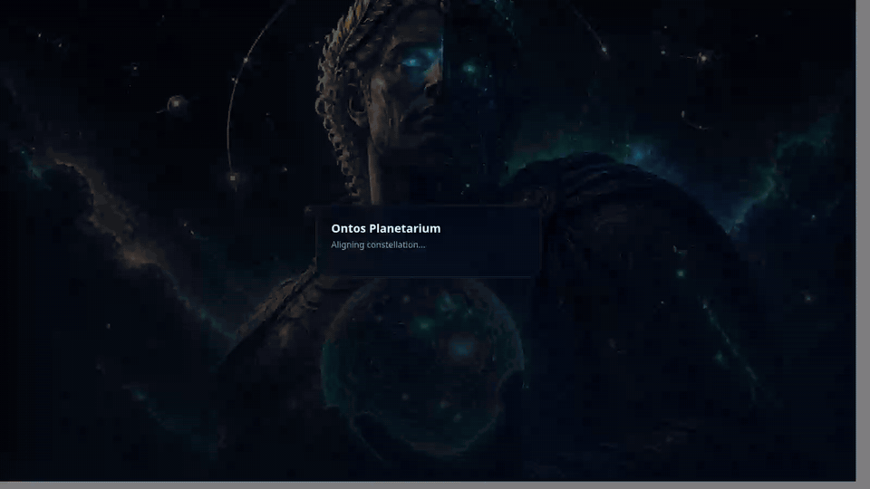

<p align="center">
  
</p>

<h1 align="center">ONTOS PLANETARIUM</h1>

<p align="center">
  <strong>Living Network Truth Galaxy</strong><br/>
  Enterprise-grade constellation UI for sockets, services, certs, and blast radius —<br/>
  with <em>local</em>, <em>Active Directory</em>, and <em>Azure AD / Entra ID</em> sign-in.
</p>

<p align="center">
  <a href="docs/INSTALL.md"></a>
  <a href="docs/AUTH.md"></a>
  <a href="LICENSE"></a>
  
</p>

---

In Greek, **ὄντως (ontos)** means *really / truly / indeed* — what is real rather than what is assumed.  
**Ontos Planetarium** turns network truth into a living galaxy operators can *ask in English*, orbit, and inspect.

> Demo media uses **synthetic RFC5737 documentation addresses only**.  
> Live collection is **off by default**. No contributor machine settings are stored in this repository.

---

## Why companies want this

| Pain | Planetarium answer |
|---|---|
| “What is actually listening?” | English ask → constellation filter |
| Tool sprawl / blind blast radius | 3D ontology + inspector ownership |
| Hybrid identity | Local · on-prem AD/LDAP · Azure AD |
| Air-gapped / regulated sites | Offline-first demo + on-prem Docker |
| Screenshot-safe demos | Synthetic data badge + demo mode |

---

## Live demos

Animated ~10s tours that play directly on this page (also available as [MP4s](media/videos/)).

<table>
<tr>
<td width="50%" valign="top">

**1. Cosmic login & identity providers**


</td>
<td width="50%" valign="top">

**2. Galaxy spin & node inspect**


</td>
</tr>
<tr>
<td width="50%" valign="top">

**3. English ask: listeners & remoting**


</td>
<td width="50%" valign="top">

**4. Expiring certs lens**



</td>
</tr>
<tr>
<td colspan="2" align="center">

**5. Blast radius theater**


</td>
</tr>
</table>

---

## Quick start (60 seconds)

```bash
git clone https://github.com/btstevens1984az/Ontos-Planetarium.git
cd Ontos-Planetarium
cp .env.example .env
docker compose up --build
```

Open **http://localhost:8080** → sign in with `admin` / `ChangeMeNow!` (change immediately).

**Native install (Linux / macOS / Windows):** see **[docs/INSTALL.md](docs/INSTALL.md)**  
**AD / Entra setup:** see **[docs/AUTH.md](docs/AUTH.md)**  
**Hardening:** see **[docs/SECURITY.md](docs/SECURITY.md)**

---

## Architecture

```text
┌────────────────────────────┐
│  React galaxy UI (Three)   │  Orbitron/Rajdhani · glass HUD
└─────────────┬──────────────┘
              │ JWT
┌─────────────▼──────────────┐
│  FastAPI  /api/auth/*      │  Local · LDAP/AD · Azure OIDC
│           /api/ontology/*  │  Snapshot · Ask · Blast
└─────────────┬──────────────┘
              │
     SQLite/Postgres (users + auth audit)
     Demo ontology (RFC5737) or optional live collect
```

---

## Features

- **3D Living Galaxy** — hosts, processes, endpoints, services, certs  
- **English Ask Bar** — `who is listening`, `expiring certs`, `cloud agents`, …  
- **Blast Radius** — expand the constellation around a target  
- **Inspector** — kind, ports, ownership metadata  
- **Enterprise auth** — local bootstrap, AD/LDAP bind, Entra ID OIDC  
- **Secure defaults** — bcrypt, JWT, rate-limit ready, security headers, no secrets in git  
- **Dockerized** — one compose file for demos and on-prem pilots  

---

## Repository hygiene (no machine leakage)

This project is engineered so **your computer settings never land in git**:

- `.env`, `data/`, editor folders, OS junk → **`.gitignore`**
- Demo ontology uses documentation IPs only  
- Optional live collect is opt-in and never uploads telemetry  
- Auth secrets only via environment variables  

---

## Tech stack

| Layer | Choice |
|---|---|
| API | Python 3.12 · FastAPI · SQLAlchemy · JWT · ldap3 · MSAL/OIDC |
| UI | React · Vite · react-force-graph-3d · Three.js |
| Packaged | Docker multi-stage · Compose |

---

## Project layout

```text
Ontos-Planetarium/
├── backend/app/          # FastAPI, auth providers, ontology
├── frontend/             # Planetarium SPA
├── docs/                 # Install · Auth · Security
├── media/images/         # Ontos deity hero + concept art
├── media/videos/         # Live product tours
├── docker-compose.yml
└── .env.example          # Safe template (copy to .env)
```

---

## License

MIT — see [LICENSE](LICENSE).

<p align="center"><sub>Built under the gaze of Ontos — truth over assumption.</sub></p>
